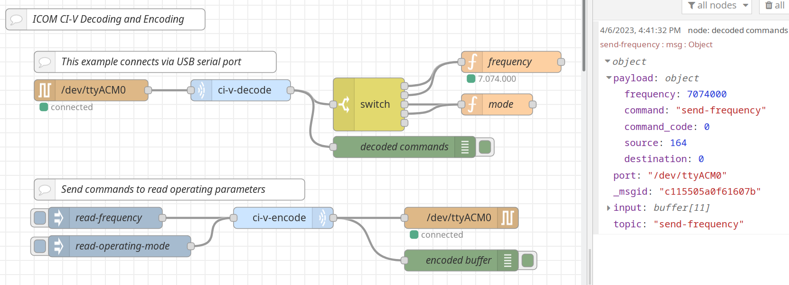

# Node Red ICOM Radio Control

This repository provides JavaScript libraries and [Node-RED](https://nodered.org/) nodes to interact with [ICOM](https://www.icomamerica.com/) radios. Including decoding and encoding the [CI-V](https://www.icomjapan.com/support/manual/3064/) protocol and ICOM's network protocol for recent radios (IC-705 in particular).

**This is a work in progress**.



See the [NOTES.md](NOTES.md) file for a bunch of random musings as I figure out how ICOM communicates over the network. While the [CI-V](https://www.icomjapan.com/support/manual/3064/) protocol is well documented, how that protocol is sent over IP or Bluetooth is not. A number of other folks have been working on the same thing and their work has been very helpful. Unfortunately,their code is not enough to *easily* write code based on it, so a lot of packet capturing and investigation is needed to understand and document the protocol enough to be usable for my purposes.

This README will be updated when things are far enough along to be working and stable for release.

## Encoding CI-V Messages

The goal of encoding is to provide as little or as much encoding as needed to
get the job done. Thus there are several ways to encode a CI-V command. The
output of the encoder is a `Buffer` object suitable for sending to a radio
over the network, serial connection, or USB emulated serial connection.

The simplest encoding operations, if you already have an encoded CI-V `command`,
`source`, `destination`, and parameters uses just the `payload` property.
Then the encoder will simply wrap your `payload` with the proper CI-V header
and footer bytes. This assumes you already properly encoded the `source`,
`destination`, `command`, and any command parameters into your `payload`.

```javascript
msg_proto1 = {
    payload: "e0a400" // if string will hex-convert first
};
```

The follong format allows you to use JavaScript properties to specify the
`source` and `destination` rather than having to encode them in the
`payload` yourself. Other than that, the `payload` is similarly wrapped 
as in the first format. In this format, you encode the `command` and any
command parameters.

```javascript
msg_proto2 = {
    source: 0x00,
    destination: 0x00,
    payload: buffer_string  // if string will hex-convert first
};
```

The following form allows you to specifiy the `source`, `destination`,
and multi-byte `command` to encode as JavaScript properties. The command's
parameters are encoded as with earlier formats, as a buffer or hex string
that will be included in the encoded output. NOTE: many commands don't need parameters, so the `payload` might be empty or not needed.

```javascript
msg_proto3 = {
    source: 0x00,
    destination: 0x00,
    command_code: 0x00,     // command_code, subcommand_code, ...
    payload: buffer_string  // as needed
};
```

The following form uses the encoder's table of CI-V commands to encode the
correct `command` and `subcommand` byte sequences (so you don't have to look
them up). Commnad parameters are still your responsibility to encode into
the `payload` if needed. NOTE: many commands don't need parameters, so the
`payload` might be empty or not needed.

```javascript
msg_proto3 = {
    source: 0x00,
    destination: 0x00,

    command: 'send-frequency',  // will translate command to command_code
    payload: buffer_string      // as needed
};
```

**This format is not available for all commands. Work in Progress**
The last format allows the entire command and parameters to be given as
JavaScript properties. It will use the `command` or `command_code` to determine
which additional parameters are needed and encode them into the output buffer.
NOTE: you can use either `command` or `command_code` as above. `command_code`
will override `command` if both are specified.

```javascript
msg_proto4 = {
    source: 0x00,
    destination: 0x00,
    // one of command or command_code (from CI-V reference)
    command: 'send-frequency',  // will translate command to command code
    command_code: 0x00,         // overrides `command` if both given

    // encoded fields as needed, varies based on command/subcommand
    frequency: 174000,
    status: 'on',
}
```

## Making Payloads

The node will use `Buffer.from()` to convert payloads that are not already
`Buffer` objects to `Buffer` objects. If the `payload` is a string the `hex`
encoding will be used. Thus your payloads can be

* a `Buffer`
* an `Array`, ex. `[0xe0, 0xa4, 0x00]`
* a hex `string`, ex `e0a400`
